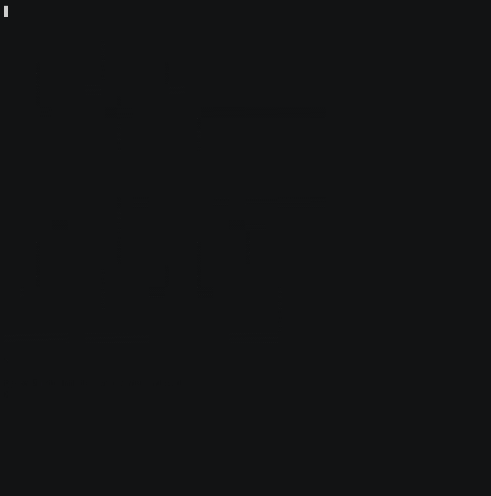

# Terrible Game System Emulator for DCC

This project is implemented according to the Dark Science Code Contest [https://github.com/darkscience/dcc](https://github.com/darkscience/dcc). It is done for fun.

## Demo

### Hi
Outputs 'Hi' on the display when pressing 'a' or 'b' keys

### Demo 1
Outputs '0' and counts up when pressing 'a' key and counts down when pressing 'b' key

### Demo1
Outputs 'dark science' as a scrolling text

